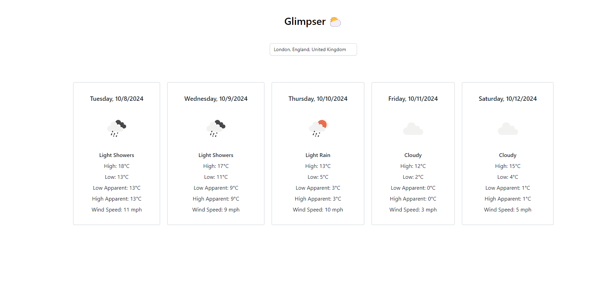
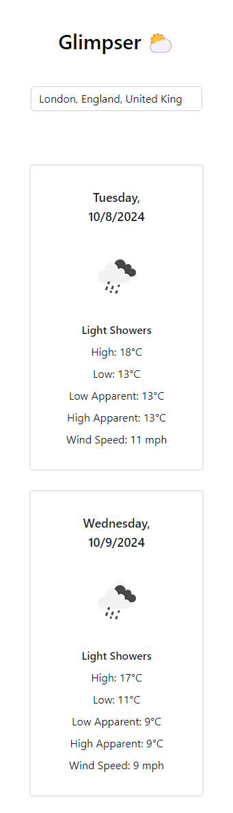

# Glimpser ⛅

### Get a Glimpse of What the Weather Holds!

## 👩‍💻 Getting the app running
Node version used: v20.15.0

- Clone the repository

- Open VSCode (optional) in this directory

- Run `npm i` to install dependencies

- Run `npm run dev` to start the development server

- Open your browser and go to http://localhost:5173

### 👀 Preview

#### Mobile
